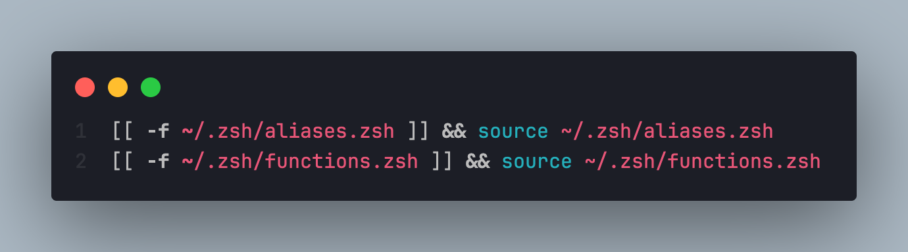

# Ed's Dotfiles

This repository contains some of my personal configuration files that I use to make my work more efficient and personalized.
It uses `alias` and `function` to perform the required tasks.

> [!NOTE]
> Configurations work well with macOS using Zsh customized with [Oh My Zsh](https://ohmyz.sh/) framework

## Features
- Change directory layer depth by number (1 to 4)
- Commit changes to local and remote repositories with one command
- Show the working branch of all target repositories with one command
- Pull changes on all target repositories with one command
- Show statuses on all target repositories with one command
- Highlight `cat` and `kubectl` command output
- Back up data from source to target with one command

## Directory structure

```
📦dotfiles
 ┣ 📂.zsh
 ┃ ┣ 📜aliases.zsh
 ┃ ┗ 📜functions.zsh
 ┣ 📂assets
 ┃ ┗ 📜zshref.png
 ┣ 📜.zshrc
 ┣ 📜LICENSE
 ┗ 📜README.md
```

## Prerequisites
- [Git](https://git-scm.com/)
- [Pygments](https://pygments.org/)
- [Rsync](https://github.com/WayneD/rsync)
- [Nerd Fonts](https://www.nerdfonts.com/font-downloads) of your choice
- [kubecolor](https://github.com/kubecolor/kubecolor)


## Installation

1. Add `.zsh` directory to your home directory.
2. Reference `aliases.zsh` and `functions.zsh` to your `.zshrc` or `.zprofile`.

3. Restart terminal.

## Usage

### Change directory

Use `..<1 to 4>` to move up the directory hierarchy:

```console
admin@macbook-pro ~/Documents/1/2/3/4 > ..2
admin@macbook-pro ~/Documents/1/2 >
```

### Git

Use `launch "<commit message>"` to commit changes directly to local and remote repository:

```console
admin@macbook-pro ~/my-repo > launch "Some commit message"
```
Use `branch` to show the working branch of all child repositories:

```console
admin@macbook-pro ~/my-project > branch
```

Use `tow` to pull changes on all child repositories:

```console
admin@macbook-pro ~/my-project > tow
```

Use `status` to check the status of all child repositories:

```console
admin@macbook-pro ~/my-project > status
```

## Syntax highlighting for `cat` command output

Use `ccat <filename>` to impose syntax highlighting on `cat` command output:

```console
admin@macbook-pro ~/my-repo > ccat my-config.yml
```

## Backup command

> [!CAUTION] 
> This is a one-way (source to target) data backup. Any data that is deleted from source will be deleted on target. dotfiles are ignored.

1. Open `aliases.zsh` and look for `alias backup=...`
2. Update the source path (`/PATH/TO/SOURCE-VOLUME/`) to the directory or volume that is to be backed up.
3. Update the target path (`/PATH/TO/TARGET-VOLUME`) to the directory or volume where the backup is to be stored
4. Save the changes and restart the terminal.

### Usage

```console
admin@macbook-pro ~/my-repo > backup
```